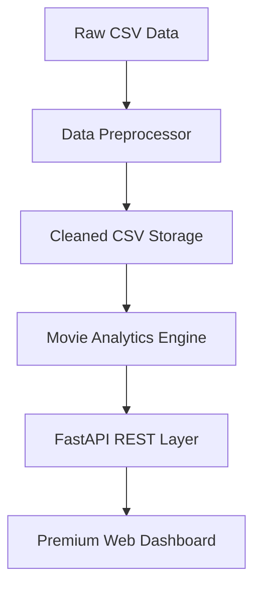

# 🎬 Movie Analytics Platform

[](https://fastapi.tiangolo.com/)
[](https://pandas.pydata.org/)
[](https://developer.mozilla.org/en-US/docs/Web/JavaScript)

A professional-grade, full-stack analytics platform that transforms raw cinematic data into actionable insights. Built with a clean **three-tier architecture**, utilizing **Pandas** for high-performance data engineering and **FastAPI** for a robust RESTful backend.

---

## 🌟 Key Features

- **Advanced Data Pipeline**: Sophisticated cleaning, normalization, and genre-explosion logic to handle messy real-world CSV data.
- **Weighted Rating Algorithm**: Implements an IMDb-style Bayesian weighted rating formula to ensure fair ranking of movies based on vote credibility.
- **High-Performance Analytics**: Efficient aggregations for yearly trends, genre distribution, and language diversity using optimized Pandas operations.
- **Premium Dark-Mode UI**: A modern, responsive dashboard built with Vanilla CSS variables, smooth micro-animations, and dynamic control visibility.
- **Production-Ready Engineering**: Centralized configuration management, modular class-based design, and comprehensive logging.

---

## 🏗 System Architecture

The project follows a modular **Service-Oriented Design**:



### Project Anatomy

```text
movie-analytics-platform/
├── api/                    # Application Entry Points
│   ├── core/               # Configuration & Settings
│   ├── routes.py           # V1 API Route Definitions
│   └── main.py             # FastAPI Factory & Middleware
├── processing/             # Intelligence Layer
│   ├── preprocess.py       # Data Pipeline (Class-based)
│   └── analytics.py        # Pandas Analytics Engine
├── frontend/               # Presentation Layer
│   ├── index.html          # Semantic HTML5 Layout
│   ├── styles.css          # Premium Dark-Theme UI
│   └── script.js           # Lightweight Reactive Logic
├── data/                   # Persistence Layer
│   ├── raw_movies.csv      # Ingest Source
│   └── cleaned_movies.csv  # SOT (Single Source of Truth)
└── requirements.txt        # Dependency Management
```

---

## 🚀 Getting Started

### 1. Prerequisites
- Python 3.9+
- Modern Web Browser (Chrome/Firefox/Safari)

### 2. Installation
```bash
# Clone the repository
git clone https://github.com/yourusername/movie-analytics-platform.git
cd movie-analytics-platform

# Create & activate virtual environment
python3 -m venv .venv
source .venv/bin/activate  # Windows: .venv\Scripts\activate

# Install dependencies
pip install -r requirements.txt
```

### 3. Initialize Data Pipeline
Before running the API, you must process the raw dataset:
```bash
export PYTHONPATH=$PYTHONPATH:.
python processing/preprocess.py
```

### 4. Launch the API Server
```bash
uvicorn api.main:app --reload
```

### 5. Open the Dashboard
Open `frontend/index.html` in your browser. The UI will automatically connect to your local backend.

---

## 📡 API Reference

### Base URL: `http://localhost:8000/api/v1`

| Endpoint | Method | Parameter | Description |
| :--- | :--- | :--- | :--- |
| `/movies/most-popular` | `GET` | `limit` (max 50) | Top movies by popularity score. |
| `/movies/top-rated` | `GET` | `limit`, `min_votes` | Weighted ratings (IMDb style). |
| `/movies/by-genre` | `GET` | - | Average rating per genre. |
| `/movies/yearly-trends` | `GET` | - | Yearly release volume statistics. |
| `/movies/language-stats`| `GET` | - | Distribution by original language. |

> **Interactive Docs**: Integrated Swagger UI available at `http://localhost:8000/docs`

---

## 🧪 Algorithms: Weighted Rating
To solve the "small vote count" bias, we use the following formula:
`WR = (v / (v + m)) * R + (m / (v + m)) * C`
- **v**: Number of votes for the movie
- **m**: Minimum votes required (70th percentile)
- **R**: Average rating of the movie
- **C**: Mean vote across the whole report

---

## 🛠 Tech Stack
- **Backend**: Python, FastAPI, Pydantic
- **Data Science**: Pandas, NumPy
- **Frontend**: HTML5, Vanilla CSS3 (Glow-morphism), Modern JavaScript (ES6+)
- **DevOps**: Pydantic Settings, Python-Dotenv, Logging
